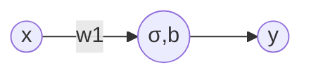
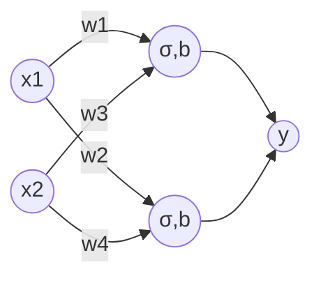

# Part One

## Perceptron


```mermaid
flowchart LR
    x((x)) -->|w1| w(("σ,b")) --> y((y))
```

## MLP


```mermaid
flowchart LR
    x1((x1)) -->|w1| w1(("σ,b")) --> y((y))
    x1 -->|w2| w2
    x2((x2)) -->|w4| w2(("σ,b")) --> y
    x2 -->|w3| w1
```

```rust
#[test]
fn x() {
    use libnotes::foo;
    let _ = foo();
}
```
